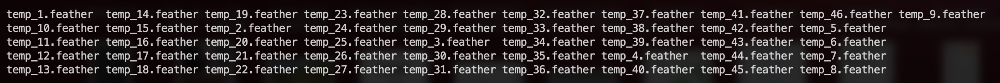

# Proyecto BD 2

### **Integrantes**

* Mario Rios Gamboa
* Luis Berrospi Rodriguez
* Angello Zuloaga Loo


| **Integrante** | **Rol** |
| --- | --- |
| Angello | Informe y base de datos |
| Luis | Frontend |
| Mario | Backend |

## **Tabla de contenido**

- [Proyecto BD 2](#proyecto-bd-2)
    - [**Integrantes**](#integrantes)
  - [**Tabla de contenido**](#tabla-de-contenido)
- [**Introducción**](#introducción)
  - [**Objetivo**](#objetivo)
  - [**Dominio de Datos**](#dominio-de-datos)
  - [**Backend**](#backend)
    - [**Construcción del Índice Invertido**](#construcción-del-índice-invertido)
    - [**Manejo de memoria secundaria y optimizaciones**](#manejo-de-memoria-secundaria-y-optimizaciones)
      - [**Manejo de memoria secundaria**](#manejo-de-memoria-secundaria)
      - [**Optimizaciones**](#optimizaciones)
    - [**Ejecución óptima de consultas**](#ejecución-óptima-de-consultas)
  - [**Frontend**](#frontend)
    - [Diseño del índice con Postgresql](#diseño-del-índice-con-postgresql)
    - [Análisis comparativo de tiempos de ejecución](#análisis-comparativo-de-tiempos-de-ejecución)
    - [Interfaz de usuario](#interfaz-de-usuario)


# **Video**

[Demo](https://drive.google.com/file/d/14rviu01hkw7KYcxpZ5FzyKvKuJ6cqAAO/view?usp=share_link)

# **Introducción**

## **Objetivo**

El siguiente proyecto consiste en la implementación de un motor de búsqueda a partir de una query textual para buscar documentos de un dataset. Para ello, se utilizarán algoritmos de búsqueda y recuperación de la información basado en el contenido para implementar de manera óptima el Índice Invertido usando el algoritmo SPIMI. Finalmente se medirá el tiempo en el que se ejecuta y será comparado con el tiempo al ejecutarlo en Postgresql.

## **Dominio de Datos**

En cuanto a los datos, se trabaja con el dataset arXiv, el cual es un repositorio con 1.7 millones de artículos en formato JSON. Con fines de optimización, se decidió trabajar con un archivo reducido incluyendo los siguientes campos:

| **Campo** | **Tipo** |
| --- | --- |
| id | `string` |
| submitter | `string` |
| title | `string` |
| doi | `string` |
| abstract | `string` |

- Se utilizará el campo **abstract** para la aplicación del índice y realizar las consultas en base a este.

## **Backend**

### **Construcción del Índice Invertido**

Para la construcción del índice invertido, se empleó el supercomputador Khipu de UTEC. Este cuenta con las siguientes características:

| **Componente** | **Especificación** |
| --- | --- |
| Sistema operativo | CentOS 7.6 |
| Procesador | Intel(R) Xeon(R) Gold 6230 CPU @ 2.10 GHz |
| Cores | 80 cores |
| RAM | 256 GB |

Para construir el índice invertido primero se partió la data en archivos de  50000 líneas, y en cada uno se aplicó el índice invertido SPIMI.
Primero, se aplicó a cada línea las functiones de `word_tokenize`, `Stemmer.stem` y se filtraron los caracteres alfanuméricos y los `stopwords`.

Luego, se construyó el índice invertido con un diccionario que iba a contener cada término como llave (SPIMI) e iba a guardar el `term frequency (tf)` de cada término. De la misma forma, se guardaban los términos en un `set` aparte para luego ordenar la escritura. De esta forma se obtuvieron 46 archivos con data ordenada.



Seguidamente, aplicamos el merge sort en memoria secundaria para ordenar los términos de cada archivo de forma cruzada en grupos de potencias de 2 hasta alcanzar una potencia que sea mayor o igual a 46. Cada iteración guardaba otros 46 archivos con los términos ordenados en las colecciones correspondientes. La última iteración iba a devolver 46 archivos con todos los términos ordenados y combinados en caso sean iguales.

Siempre se mantuvieron 3 buffers en memoria, estos son llamados en el código `first_buffer`, `second_buffer` y `output_buffer`. Estos se llenaban y vaciaban de acuerdo a la cantidad de términos que se iban a escribir en cada archivo que era aproximado a la cantidad de términos del primer buffer que se leía. A continuación, el principal algoritmo de combinación de términos:

```python
while not first_buffer.empty and not second_buffer.empty:
    first_word = first_buffer.index[0]
    second_word = second_buffer.index[0]
    if first_word < second_word:
        output_buffer = pd.concat([output_buffer, first_buffer.iloc[0:1, :]])
        first_buffer.drop(first_word, inplace=True)
    elif first_word > second_word:
        output_buffer = pd.concat([output_buffer, second_buffer.iloc[0:1, :]])
        second_buffer.drop(second_word, inplace=True)
    else:
        posting_list = first_buffer.loc[first_word, 'posting_list'] + second_buffer.loc[
            second_word, 'posting_list']
        combined = pd.DataFrame({'word': [first_word],
                                    'posting_list': [posting_list]})
        combined.set_index('word', inplace=True)
        output_buffer = pd.concat([output_buffer, combined])
        first_buffer.drop(first_word, inplace=True)
        second_buffer.drop(second_word, inplace=True)
```

### **Manejo de memoria secundaria y optimizaciones**

#### **Manejo de memoria secundaria**

- Se guardaba cada subíndice invertido como un dataframe con el encoding `feather`. Este es un formato binario que se enfoca en proveer operaciones de I/O más eficientes y rápidas.

- Cada archivo del índice final poseía un aproximado de 80 MB, cabe resaltar que no todos los archivos estaban llenos. Pues las palabras se combinaban. En este caso, de los 46 archivos, solo 10 estaban con información.

- El archivo data inicial poseía un tamaño de 3.6 GB.

#### **Optimizaciones**

Para acelerar enormemente el proceso de construcción del índice invertido, se empleó multiprocessing. Como las tareas de construcción de la partición inicial y el merge sort son independientes en cada ciclo. Se emplearon los 80 cores del supercomputador para acelerar el proceso. Para ello, se utilizó la librería `multiprocessing` de Python. De la misma forma, se emplearon diccionarios e índices de Pandas para reducir el tiempo de acceso a los términos y sus frecuencias.

Con todo esto, se lograron los siguientes resultados en cuanto a la construcción del índice invertido:

- Partición inicial

|  **Tiempo de ejecución** | **Optimización** |
| --- | --- |
|  602.34 s | Sí |
|  5377.75 s | No |

- Merge sort

|  **Tiempo de ejecución** | **Optimización** |
| --- | --- |
|  9444.71 s | Sí |
|  30582.92 s| No |

### **Ejecución óptima de consultas**

Todas las consultas se ejecutaron en un computador local, con las siguientes características:

| **Componente** | **Especificación** |
| --- | --- |
| Sistema operativo | Mac OS 13.4 |
| Procesador | Apple Silicon M1 |
| Cores | 8 cores |
| RAM | 8 GB |

Para las consultas, se empleó el score `tf-idf`. Primeramente, se aplicó el mismo procesamiento de texto que en la construcción del índice invertido. Seguidamente se calculó el score `tf-idf` de cada término sobre la misma consulta. Finalmente, se normalizó el vector de scores de la consulta.

Seguidamente, se calculó el score `tf-idf` de cada término sobre cada documento que contenía los términos, para ello se encontraba el índice invertido del término sobre los 46 archivos resultantes del merge sort. Finalmente, se normalizó el vector resultante y el score de cada documento se calculó como el producto punto entre el vector de la consulta y el vector del documento.

El resultado final fueron los primeros k documentos con mayor score.

En este proceso, se aplicarón las siguientes optimizaciones:

- Para encontrar el índice invertido con el registro correspondiente a cada término se empleó búsqueda binaria, para evitar leer cada archivo de forma secuencial. Como los archivos estaban ordenados, esto era factible.

```python
left = 1
right = total_files
while left <= right:
    mid = (left + right) // 2
    data = pd.read_feather(f'processed/{mid}.feather')
    filter = data[data['word'] == word].copy()
    if filter.empty:
        if word < data['word'].iloc[0]:
            right = mid - 1
        else:
            left = mid + 1
    else:
        filter['posting_list'] = filter['posting_list'].apply(lambda x: json.loads(x))
        return filter
```

- Se empleó un diccionario para guardar el registro del índice invertido de cada término. De esta forma, se evitaba la búsqueda binaria para cada término.

- Se empleó un diccionario para guardar el idf de cada término. De esta forma, se evitaba buscar su frecuencia en el índice invertido de manera repetida.

- Se ignoraron los documentos que no contenían ninguno de los términos.

- Se empleó un diccionario para guardar la relación entre cada término y el diccionario de los `docId - tf` de cada término. De esta forma, se evitaba el recorrido lineal de los documentos para cada término.

De esta forma, se obtuvieron los siguientes resultados:

<!-- 7.74  | 85.12 -->
<!-- 20.13  | 77.30 -->
<!-- 9.74  | 104.54 -->

- Con optimizaciones

| **Consulta** | **K** | **Tiempo de ejecución** |
| --- | --- | --- |
|  "distributed memory and b+Trees" | 5 | 7.74 s |
|  "dota 2 assesment using iot" | 5 | 20.13 s |
|  "bsbi indexing for large datasets" | 5 | 9.74 s |

- Sin optimizaciones

| **Consulta** | **K** | **Tiempo de ejecución** |
| --- | --- | --- |
|  "distributed memory and b+Trees" | 5 | 3246.91 s |

## **Frontend**

### Diseño del índice con Postgresql

Para diseñar el índice invertido en Postgresql 14, se empleó el GIN index. Seguidamente se limpió la data (carácteres extraños y columnas no necesarias) del archivo de data principal para luego ser insertado a una tabla temporal con una única columna de tipo `jsonb`. Finalmente, se insertó la data de la tabla temporal a la tabla final con el índice GIN. Tanto el script de limpieza como el de la creación del índice se pueden encontrar en la carpeta backend/utils.


### Análisis comparativo de tiempos de ejecución

| **Consulta** | **K** | **Tiempo de ejecución** |
| --- | --- | --- |
|  "distributed memory and b+Trees" | 5 | 85.12 s |
|  "dota 2 assesment using iot" | 5 | 77.30 s |
|  "bsbi indexing for large datasets" | 5 | 104.54 s |

### Interfaz de usuario

Para la comunicación con el backend se diseño una comunicación por CLI utilizando el formato JSON. Se empleó `sqlalchemy` y `psycopg2` para la conexión con la base de datos.

